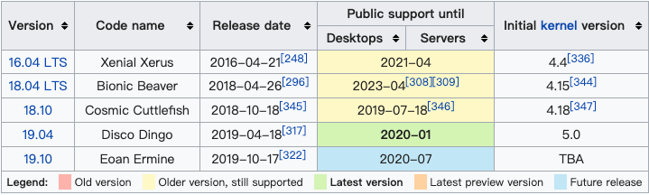

# Outline VPN

- [Outline VPN](#outline-vpn)
  - [#1 Introduction](#1-introduction)
    - [1 - Why Outline](#1---why-outline)
      - [❤️Internet access you can trust](#%e2%9d%a4%ef%b8%8finternet-access-you-can-trust)
      - [🔐Strong privacy and security](#%f0%9f%94%90strong-privacy-and-security)
      - [🛠Built for news organizations](#%f0%9f%9b%a0built-for-news-organizations)
    - [2 - About us](#2---about-us)
    - [3 - Get involved](#3---get-involved)
    - [4 - Help](#4---help)
  - [#2 Get Outline Manager Client](#2-get-outline-manager-client)
    - [Description](#description)
    - [Download](#download)
  - [#3 Get Outline Client](#3-get-outline-client)
    - [Description](#description-1)
    - [Download](#download-1)
  - [#4 How to install Outline On Ubuntu Server 19.04 and Ubuntu Desktop 19.04?](#4-how-to-install-outline-on-ubuntu-server-1904-and-ubuntu-desktop-1904)
    - [Prerequisites](#prerequisites)
    - [Ubuntu Server](#ubuntu-server)
      - [Step1 - Installing Docker CE Environment on an Ubuntu Server](#step1---installing-docker-ce-environment-on-an-ubuntu-server)
      - [Step2 - Installing Outline VPN server on an Ubuntu Server](#step2---installing-outline-vpn-server-on-an-ubuntu-server)
    - [Ubuntu Desktop](#ubuntu-desktop)
      - [Step1 Download Linux AppImages and Icons](#step1-download-linux-appimages-and-icons)
      - [Step2 Create specified directories](#step2-create-specified-directories)
      - [Step3 Grant permissions and move locations](#step3-grant-permissions-and-move-locations)
      - [Step4 Touch and edit files for desktop launchers](#step4-touch-and-edit-files-for-desktop-launchers)
      - [Step5 Move the main directory `Outline` to `/opt`](#step5-move-the-main-directory-outline-to-opt)
      - [Step6 Create soft links](#step6-create-soft-links)
      - [Step7 Set startup application preferences](#step7-set-startup-application-preferences)
   - [#5 One-click Shell Script](#5-one-click-shell-script)

## #1 Introduction

>  **Outline VPN - Making it safer to break the news.**

Journalists need safe access to information to research issues, communicate with sources, and report the news. Outline lets news organizations easily provide their network safer access to the open internet.

+ **Official Website**: [Download from https://getoutline.org](https://getoutline.org) (**Need** proxies in mainland China🇨🇳)
+ **Official Object-Based Storage Website**: [Download from Amazon S3](https://s3.amazonaws.com/outline-vpn/index.html) (**No need** proxies in mainland China🇨🇳)

### 1 - Why Outline

#### ❤️Internet access you can trust

Outline makes it easy for news organizations to set up a corporate virtual private network (VPN) on their own server to more safely connect to the internet and keep their communication private.

Outline is completely open source and was audited by [Radically Open Security](https://radicallyopensecurity.com) ([2017](https://s3.amazonaws.com/outline-vpn/static_downloads/ros-report.pdf)) and [Cure53](https://cure53.de) ([2018](https://s3.amazonaws.com/outline-vpn/static_downloads/cure53-report.pdf)).

#### 🔐Strong privacy and security

Outline gives you control over your privacy by letting you operate your own server and Outline never logs your web traffic. Strong encryption helps keep your communications private.

Outline servers automatically update with the latest security settings, so you don’t have to worry about keeping software up-to-date.

#### 🛠Built for news organizations

Outline is easy to set up and manage. Organizations can set up their own server in just a few minutes—no tech savvy required.

Owning your server lets you control the number of people who have access to it, which can help maintain consistent internet speeds even during peak traffic hours.

### 2 - About us

Outline is an open source project created by Jigsaw to provide a safer way for news organizations and journalists to access the internet.

### 3 - Get involved

Outline is powered by [Shadowsocks](https://shadowsocks.org) and is still an early stage project. You can contribute to the code on [GitHub](https://github.com/Jigsaw-Code/?q=outline), and follow us on [Reddit](https://www.reddit.com/r/outlinevpn) and [Medium](https://medium.com/jigsaw) to hear when we expand to more platforms and add new features.

### 4 - Help

💬[Help Center](https://support.getoutline.org)

:octocat:[GitHub](https://github.com/Jigsaw-Code/?q=outline)

🧲[Terms of Service](https://s3.amazonaws.com/outline-vpn/static_downloads/Outline-Terms-of-Service.html)

[🧬Data Collection Policy](https://support.getoutline.org/s/article/Data-collection)

[⚠️Privacy Policy](https://www.google.com/policies/privacy)

## #2 Get Outline Manager Client


### Description

The Outline Manager application creates and manages Outline servers, powered by [Shadowsocks](https://shadowsocks.org). It uses the [Electron](https://electronjs.org) framework to offer support for Windows, macOS and Linux. 

An Outline server runs instances of Shadowsocks proxies and provides an API used by the Outline Manager application.

### Download

|**OS**|**Download**|
|:---:|:---:|
|**Windows 7.0+**|[](https://raw.githubusercontent.com/Jigsaw-Code/outline-releases/master/manager/stable/Outline-Manager.exe)|
|**Most of Linux Releases**|[](https://raw.githubusercontent.com/Jigsaw-Code/outline-releases/master/manager/stable/Outline-Manager.AppImage)|
|**macOS 10.9+**|[](https://raw.githubusercontent.com/Jigsaw-Code/outline-releases/master/manager/stable/Outline-Manager.dmg)|
## #3 Get Outline Client


### Description

The Outline Client is a cross-platform VPN or proxy client for Windows, macOS, iOS, Android, and Chrome OS. The Outline Client is designed for use with the [Outline Server](https://github.com/Jigsaw-Code/outline-server) software, but it is fully compatible with any [Shadowsocks](https://shadowsocks.org) server.

The client's user interface is implemented in [Polymer](https://www.polymer-project.org/) 2.0. Platform support is provided by [Cordova](https://cordova.apache.org/) and [Electron](https://electronjs.org), with additional native components in this repository.

### Download
|**OS**|**Download**|
|:---:|:---:|
|**Windows 7.0+**|[](https://raw.githubusercontent.com/Jigsaw-Code/outline-releases/master/client/stable/Outline-Client.exe)|
|**Most of Linux Releases**|[​](https://raw.githubusercontent.com/Jigsaw-Code/outline-releases/master/client/stable/Outline-Client.AppImage)|
|**macOS 10.11+**|[](https://apps.apple.com/us/app/outline-app/id1356178125)|
|**iOS 9.0+**|[](https://apps.apple.com/us/app/outline-app/id1356177741)|
|**Android 5.0+**|[​](https://raw.githubusercontent.com/Jigsaw-Code/outline-releases/master/client/Outline.apk)**or**[](https://play.google.com/store/apps/details?id=org.outline.android.client)|
|**Chrome OS 64.0+**|[](https://play.google.com/store/apps/details?id=org.outline.android.client)|

## #4 How to install Outline On Ubuntu Server 19.04 and Ubuntu Desktop 19.04?

### Prerequisites

+ **Version**: Ubuntu Server 16.04 LTS, Ubuntu Desktop 16.04 LTS, Ubuntu Server 18.04 LTS, Ubuntu Desktop 18.04 LTS, Ubuntu Server 18.10, Ubuntu Desktop 18.10, Ubuntu Server 19.04 or Ubuntu Desktop 19.04
+ **Linux Kernel Version**: >= v3.10
+ **Architecture**: AMD or ARM
+ **Number of Bit**: 64-bit
+ **Security**: Lastest version or Older version, still supported
+ **User**: A non-root user

According to partial [Table of Ubuntu versions](https://en.wikipedia.org/wiki/Ubuntu_version_history) from Wikipedia: 



By default, the above versions of the 64-bit Ubuntu operating system meets these requirements.

### Ubuntu Server

#### Step1 - Installing Docker CE Environment on an Ubuntu Server

[Docker](https://www.docker.com) is an application that simplifies the process of managing application processes in *containers*. Containers let you run your applications in resource-isolated processes. They're similar to virtual machines, but containers are more portable, more resource-friendly, and more dependent on the host operating system.

For a detailed introduction to Docker, check out [Docker Official Documentation](https://docs.docker.com).

First, update your existing list of packages:
```bash
$ sudo apt update
```

Next, install a few prerequisite packages which let `apt` use packages over HTTPS:

```bash
$ sudo apt install apt-transport-https ca-certificates curl software-properties-common
```

Then add the GPG key for the official Docker repository to your system:

```bash
$ curl -fsSL https://download.docker.com/linux/ubuntu/gpg | sudo apt-key add -
```

Add the Docker repository to APT sources:

+ If Ubuntu Server 19.04 or Ubuntu Desktop 19.04.

```bash
$ sudo add-apt-repository "deb [arch=amd64] https://download.docker.com/linux/ubuntu $(lsb_release -cs) stable edge test"
```

+ If Ubuntu Server 16.04 LTS, Ubuntu Desktop 16.04 LTS, Ubuntu Server 18.04 LTS, Ubuntu Desktop 18.04 LTS, Ubuntu Server 18.10 or Ubuntu Desktop 18.10.
```bash
$ sudo add-apt-repository "deb [arch=amd64] https://download.docker.com/linux/ubuntu $(lsb_release -cs) stable"
```

Next, update the package database with the Docker CE packages from the newly added repo:

```bash
$ sudo apt update
```

Make sure you are about to install from the Docker CE repo instead of the default Ubuntu repo:

```bash
$ apt-cache policy docker-ce
```

You'll see output like this, although the version number for Docker CE may be different:

```bash
docker-ce:
  Installed: (none)
  Candidate: 5:19.03.0~2.3.rc3-0~ubuntu-disco
  Version table:
     5:19.03.0~2.3.rc3-0~ubuntu-disco 500
        500 https://download.docker.com/linux/ubuntu disco/test amd64 Packages
     5:19.03.0~2.2.rc2-0~ubuntu-disco 500
        500 https://download.docker.com/linux/ubuntu disco/test amd64 Packages
     5:19.03.0~1.5.beta5-0~ubuntu-disco 500
        500 https://download.docker.com/linux/ubuntu disco/test amd64 Packages
     5:19.03.0~1.4.beta4-0~ubuntu-disco 500
        500 https://download.docker.com/linux/ubuntu disco/test amd64 Packages
     5:19.03.0~1.3.beta3-0~ubuntu-disco 500
        500 https://download.docker.com/linux/ubuntu disco/test amd64 Packages
     5:19.03.0~1.2.beta2-0~ubuntu-disco 500
        500 https://download.docker.com/linux/ubuntu disco/test amd64 Packages
     5:19.03.0~1.1.beta1-0~ubuntu-disco 500
        500 https://download.docker.com/linux/ubuntu disco/test amd64 Packages
```

Notice that `docker-ce` is not installed, but the candidate for installation is from the Docker CE repository for Ubuntu 19.04 (`disco`).

Then, install Docker CE:

```bash
$ sudo apt install docker-ce
```

Docker CE should now be installed, the daemon started, and the process enabled to start on boot. Check that it's running:

```bash
$ sudo systemctl status docker.service
```

The output should be similar to the following, showing that the service is active and running:

```bash
● docker.service - Docker Application Container Engine
   Loaded: loaded (/lib/systemd/system/docker.service; enabled; vendor preset: enabled)
   Active: active (running) since Mon 2019-07-15 15:13:17 UTC; 1min 50s ago
     Docs: https://docs.docker.com
 Main PID: 24270 (dockerd)
    Tasks: 9
   Memory: 45.0M
   CGroup: /system.slice/docker.service
           └─24270 /usr/bin/dockerd -H fd:// --containerd=/run/containerd/containerd.sock
```

Finally, set the service to boot from the boot:

```bash
$ sudo systemctl enable docker.service
```

#### Step2 - Installing Outline VPN server on an Ubuntu Server

First, get an Outline official server one-click installation bash script `install_server.sh` and run this bash script:

```bash
$ sudo bash -c "$(wget -qO- https://raw.githubusercontent.com/Jigsaw-Code/outline-server/master/src/server_manager/install_scripts/install_server.sh)"
```
You will see lots of output from the script: first, it checks for the necessary programs (Docker), creates secret keys, and then downloads and starts two Docker containers: a shadowbox server and a watchtower server to update shadowbox as needed.

When the Outline VPN server installation script finishes, you’ll see some output similar to the following:

```bash
> Verifying that Docker is installed .......... OK
> Verifying that Docker daemon is running ..... OK
> Creating persistent state dir ............... OK
> Generating secret key ....................... OK
> Generating TLS certificate .................. OK
> Generating SHA-256 certificate fingerprint .. OK
> Starting Shadowbox .......................... OK
> Starting Watchtower ......................... OK
> Waiting for Outline server to be healthy .... OK
> Creating first user ......................... OK
> Adding API URL to config .................... OK
> Checking host firewall ...................... BLOCKED
OK

CONGRATULATIONS! Your Outline server is up and running.

To manage your Outline server, please copy the following line (including curly
brackets) into Step 2 of the Outline Manager interface:

{"apiUrl":"https://YOUR_UBUNTU_SERVER_IP_ADDRESS_EXAMPLE:TCP_PORT_EXAMPLE/XXXXXXXXXXXXXXXXXXXXXX","certSha256":"XXXXXXXXXXXXXXXXXXXXXXXXXXXXXXXXXXXXXXXXXXXXXXXXXXXXXXXXXXXXXXXX"}

You won’t be able to access it externally, despite your server being correctly
set up, because there's a firewall (in this machine, your router or cloud
provider) that is preventing incoming connections to ports TCP_PORT_EXAMPLE and TCP_AND_UDP_PORT_EXAMPLE.

Make sure to open the following ports on your firewall, router or cloud provider:
- Management port TCP_PORT_EXAMPLE, for TCP
- Access key port TCP_AND_UDP_PORT_EXAMPLE, for TCP and UDP
```

Keep that information safe, as you’ll need it in the other steps. For now, rejoice: You have successfully installed an Outline VPN server!

### Ubuntu Desktop

#### Step1 Download Linux AppImages and Icons

First, download Linux AppImages for [Outline-Manager](https://raw.githubusercontent.com/Jigsaw-Code/outline-releases/master/manager/stable/Outline-Manager.AppImage) Client and [Outline](https://raw.githubusercontent.com/Jigsaw-Code/outline-releases/master/client/stable/Outline-Client.AppImage) Client by above steps **#2 Get Outline Manager Client** and **#3 Get Outline Client**. And then, download icons for the two clients: 

```bash
$ sudo wget https://raw.githubusercontent.com/seingshinlee/outline-vpn-mirrors/master/statics/outline-manager-client.png && sudo wget https://raw.githubusercontent.com/seingshinlee/outline-vpn-mirrors/master/statics/outline-client.png
```

#### Step2 Create specified directories

Recursively, create the specified directories:
```bash
$ sudo mkdir -p Outline/{outline-manager,outline}
```
#### Step3 Grant permissions and move locations

Grant permissions that two client programs can execute:
```bash
$ sudo chmod a+x *.AppImage
```
Move the two programs to the two directories you just created: 
```bash
$ sudo mv Outline-Manager.AppImage Outline/outline-manager && sudo mv Outline-Client.AppImage Outline/outline
```
Then, move the two icons to the same two directories you just created: 
```bash
$ sudo mv outline-manager.png Outline/outline-manager && sudo mv outline.png Outline/outline
```
#### Step4 Touch and edit files for desktop launchers

For Outline Manager:

```bash
$ sudo cat > Outline/outline-manager/outline-manager.desktop << EOF
[Desktop Entry]
Encoding=UTF-8
Name=Outline Manager
Name[zh_CN]=大纲管理器
GenericName=Outline VPN - Outline Manager Client
Comment=The Outline Manager application creates and manages Outline servers, powered by Shadowsocks.
Exec=/opt/Outline/outline-manager/Outline-Manager.AppImage %f
Icon=/opt/Outline/outline-manager/outline-manager-client.png
Terminal=false
Type=Application
Categories=Internet;
StartupNotify=true
EOF
```

For Outline:
```bash
$ sudo cat > Outline/outline/outline.desktop << EOF
[Desktop Entry]
Encoding=UTF-8
Name=Outline
Name[zh_CN]=大纲
GenericName=Outline VPN - Outline Client
Comment=The Outline Client is a cross-platform VPN or proxy client for Windows, macOS, iOS, Android, and Chrome OS.
Exec=/opt/Outline/outline/Outline-Client.AppImage %f
Icon=/opt/Outline/outline/outline-client.png
Terminal=false
Type=Application
Categories=Internet;
StartupNotify=true
EOF
```

#### Step5 Move the main directory `Outline` to `/opt`

```bash
$ sudo mv Outline /opt
```

#### Step6 Create soft links

For `outline-manager.desktop`:

```bash
$ sudo ln -s /opt/Outline/outline-manager/outline-manager.desktop /usr/share/applications/outline-manager.desktop
```

For `outline.desktop`:

```bash
$ sudo ln -s /opt/Outline/outline/outline.desktop /usr/share/applications/outline.desktop
```

#### Step7 Set startup application preferences

Last, run the command and pop-up the window about `Startup application preferences`:

```bash
$ gnome-session-properties
```

Choose `Outline-Manager.AppImage`, click `Edit`, modify the `command` to `/opt/Outline/outline-manager/Outline-Client.AppImage`, and finally save it. 

The same reason, you can choose `Outline-Client.AppImage`, click `Edit`, modify the `command` to `/opt/Outline/outline/Outline-Client.AppImage`, and finally save it.

At this point, you completely installed and configured all. Now, Let us reboot computer and try it!

## #5 One-click Shell Script

TODO